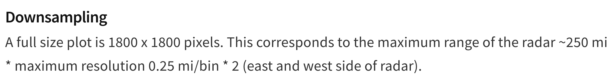
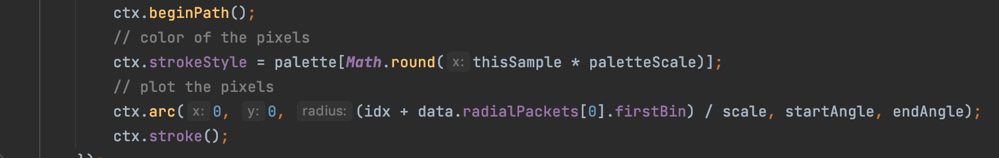
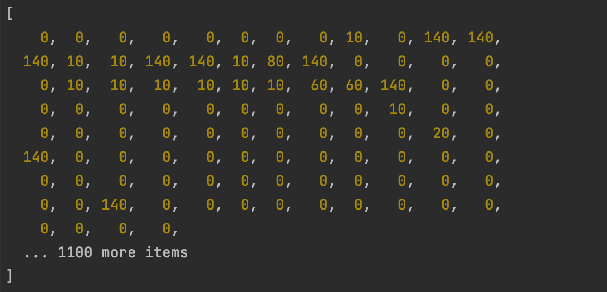

# GoogleMapProjection

GoogleMapProjection is a class for pasting nexrad level 3 plots onto a given google map.

## Directories

    GoogleMapProjection
        |—— data                        // where the nexrad-level-3-data files are stored\
        |—— outputs                     // where the composition of images is put
            |—— googleMap.png           // the final result
            |—— tmp.png                 // a temporary picture for nexrad-level-3-plot
        |—— src                         // source code
            |—— GoogleMapProjection.js  // the GoogleMapProjection class
        |—— utils                       // helper functions
            |—— index.js                // where all helper functions are exported
            |—— LatLng.js               // helper functions for latlng computations
            |—— netsblox.js             // helper functions copied from netsBlox
        |—— index.js
        |—— packeage.json
        |—— package-lock.json
        |—— README.md

## Process of Projection
    
To paste a nexrad plot onto a static google map, we follow these steps:

    1. get the bounding box in LatLng given the LatLng of the center of the nexrad plot
        1) the central LatLng of the nexrad plot can be acquired from nexrad-level-3-data
        2) the bounding box is always 460km x 460km, the source is from nexrad-level-3-plot npm:
       

      
    2. transform the bounding box from LatLng to XY
        1) we use the helper functions in netsblox.js to accomplish this
    
    3. for each pixel xy within the bounding box, transform it back to LatLng, get the corresponding pixel on nexrad plot from Latlng, paste the color of that pixel onto xy
        1) nexrad plot is just plain 2D, because nexrad-level-3-plot does not perform any additional processing when it draws the plot
           

           
           "ctx.strokeStyle = palette[Math.round(thisSample * paletteScale)];" sets the color of the arc

           "ctx.arc(0, 0, (idx + data.radialPackets[0].firstBin) / scale, startAngle, endAngle);" draws the arc the radius 
            with just idx, as data.radialPackets[0].firstBin is always 0 and scale is 1 for a 1800x1800 plot, which is the standard condition

            The algorithm iterate through each radial.bins in nexrad-level-3-data to get each idx. Each radial.bins looks like this

            An element with a zero value indicates that the pixel is not colored. An element with a nonzero value is colored.
            The index indicates distance from center. And the plot is drawn directly using these information.

           Moreover, I am not seeing any discussion about projection of nexrad data anywhere in the offcial documentation, 
            which further convinces me that nexrad plot is just a plain 2D image of its products

        2) since nexrad plot does not involve distortion, and it covers the range of 230km(radius), we can get the distance 
            in km that a pixel represents; we can easily locate a specific pixel on nexrad plot given LatLng

## Other Thoughts
    
    1. The fact that nexrad plot is just a plain 2D image may seem incredible. However, I really did not find evidence indicating that 
        it is distorted. I am more than happy to keep studying the source code and official documents to examine its projection.
        The final result actually looks correct. 

    2. It takes some time to plot the google static map, plot the nexrad file, and perform pixel-specific operation with Jimp.
        Right now I deal with this problem by using a lot of Promise and setTimeout. However, in order to decrease the
        possibility of having an error(e.g. the nexrad plot is not generated when pixel-specific operation is performed),
        efficiency is sacrificed(the program waits a lot). Is there any better solution that I can try? Or is it just fine 
        to lose some efficiency?
      
    

    
